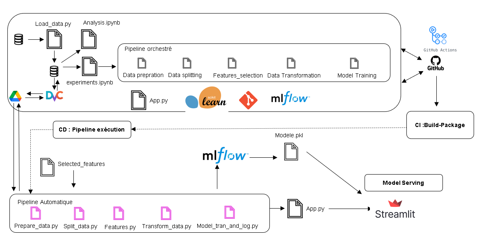
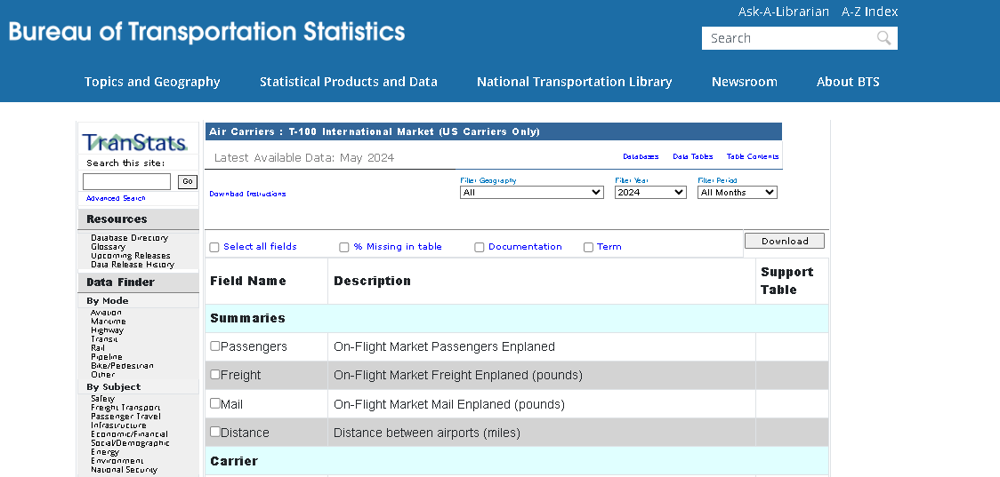
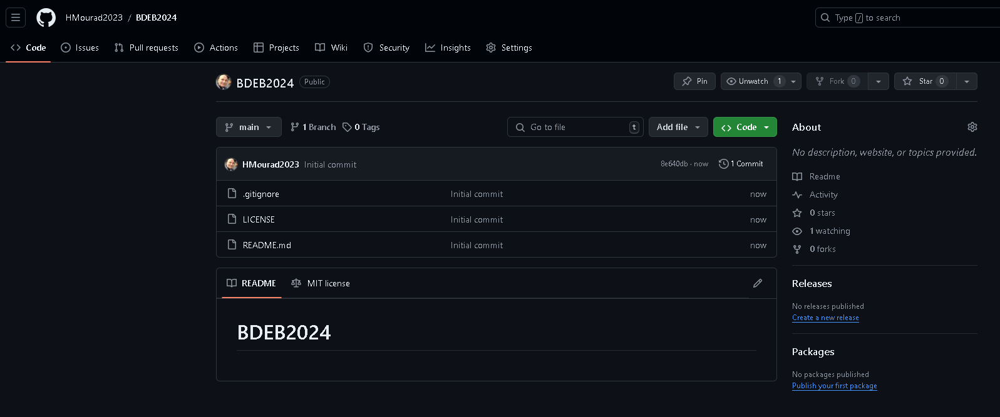
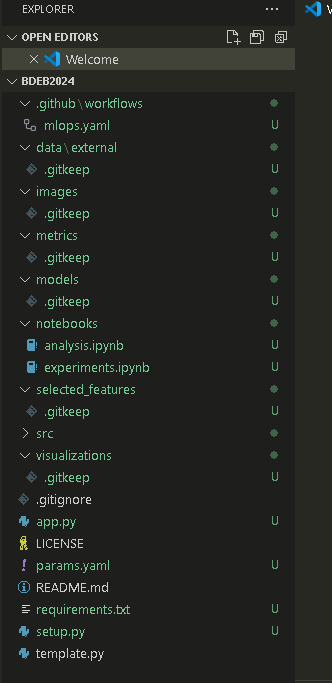
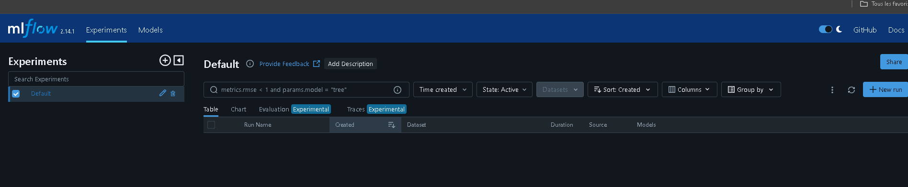
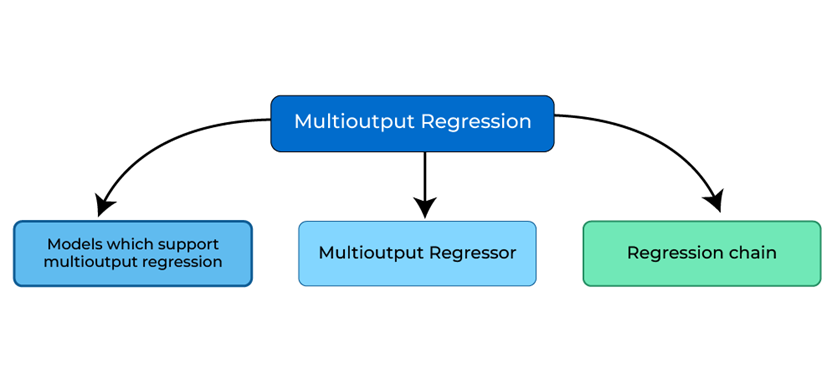
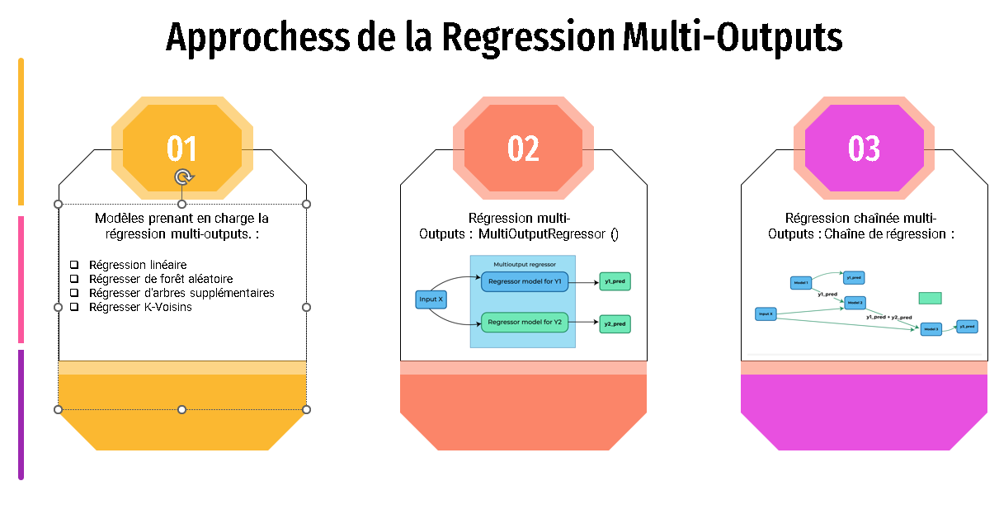
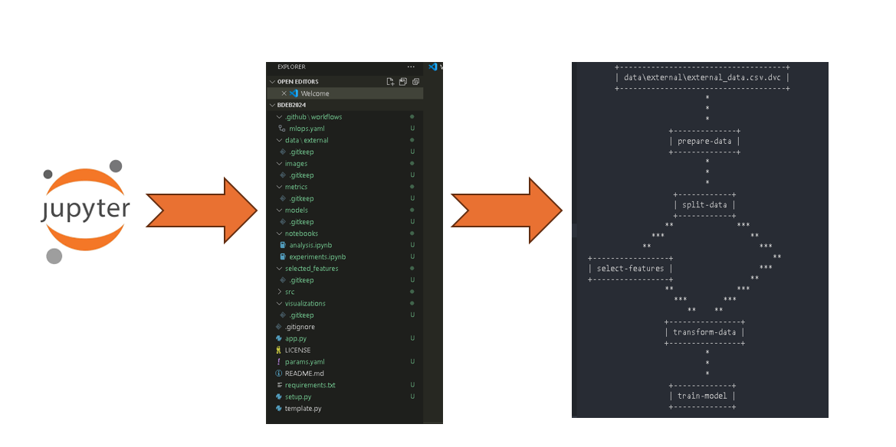
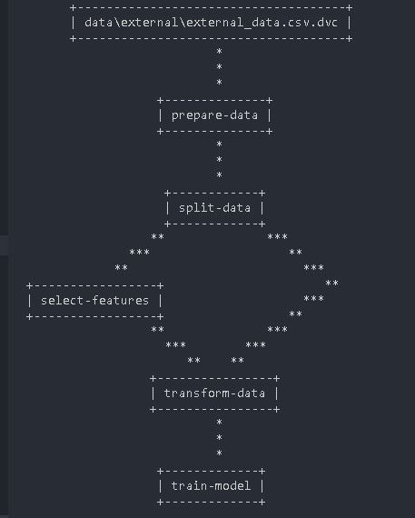

<h2 style="color:blue;">Projet : Prédiction du nombre de passagers, des quantités de fret et de courrier</h2>


<p align="center">
  
</p>

<h2 style="color:blue;">Proposition de valeur (Proof of Concept) :</h2>

Les compagnies aériennes doivent relever des défis pour optimiser leurs opérations, en particulier dans la gestion des ressources humaines, matérielles, et financières. Un dimensionnement approprié des ressources humaines et une affectation optimale des avions aux vols sont cruciaux pour réduire les coûts et maximiser les revenus.

<h2 style="color:blue;">Solution proposée :</h2>

Nous proposons un modèle d'apprentissage automatique pour prédire le nombre de passagers, ainsi que les quantités de fret et de courrier. Cette solution permettra d’optimiser la gestion des ressources humaines et matérielles des compagnies aériennes en intégrant ces prévisions dans leur système de planification.

<p align="center">
  
</p>

<h2 style="color:blue;">Planification des activités :</h2>

Nous avons utilisé ClickUp pour structurer et suivre les activités du projet. Cette plateforme centralise les tâches, documents, communications, et outils de collaboration, permettant de planifier et gérer efficacement le travail en équipe.

<h2 style="color:blue;">Les Exigences fonctionnelles et non fonctionnelles :</h2>

<h3 style="color:blue;">1) Les Exigences fonctionnelles :</h3>

- Prédiction du nombre de passagers, des quantités de fret et de courrier.
- Conception de la solution avec une approche MLOps couvrant tout le cycle de vie du projet.
- Surveillance des performances du modèle avec MLFlow.
- Configuration de pipelines CI/CD avec GitHub Actions.
- Versionnement et collaboration du code source sur GitHub.
- Développement de l'application web avec Streamlit.
- Gestion des données avec DVC sur Google Drive.
- Déploiement en production sur Streamlit Cloud Community.
- Développement des modèles en Python avec Scikit-learn.
- Tests des modèles avec Pytest.

<h3 style="color:blue;">2) Les Exigences non fonctionnelles :</h3>

- Fiabilité du modèle.
- Scalabilité de la solution.
- Sécurité des données et de l'application.
- Facilité de maintenance et d'évolution du code.

<h2 style="color:blue;">Plan de conception de la solution :</h2>

<p align="center">
  
</p>

<h2 style="color:blue;">Collecte des données :</h2>

Les données sont téléchargées depuis le site officiel du Bureau of Transportation Statistics du ministère des transports américain et sauvegardées dans un dossier nommé `data_source`.
- **Lien :** [Bureau Transportation Statistics](https://www.transtats.bts.gov/)

<p align="center">
  
</p>

<h2 style="color:blue;">Préparation de l’espace de travail :</h2>

<h2 style="color:blue;">Création d'un repository sur GitHub :</h2>

1. Connectez-vous à GitHub : [github.com](https://github.com)

2. Créer un nouveau repository :
    - Repository Name : `BDEB2024`
    - Public : Choisissez Public.
    - Initialize this repository with :
        - Add a README file : Cochez cette case.
        - Add .gitignore : Choisissez un modèle approprié.
        - Choose a license : Sélectionnez une licence si nécessaire.
    - Créer le Repository : Cliquez sur "Create repository".

<p align="center">
  
</p>  

3. Obtenir l’URL du Repository :
    - Accédez au repository sur GitHub.
    - Cliquez sur "Code" et copiez l’URL.

4. Ouvrir le Terminal ou l’Invite de Commandes :
    - Créer et Naviguer vers le Dossier :

        ```bash
        cd Desktop
        mkdir ProjetDeSynthese2024
        cd ProjetDeSynthese2024
        ```
    - Cloner le Repository :
        ```bash
        git clone https://github.com/HMourad2023/BDEB2024.git
        cd BDEB2024
        ```
    - Accéder à Visual Studio Code (VS Code) :
        ```bash
        code .
        ```
<h2 style="color:blue;">Création d'un Environnement Virtuel avec Conda :</h2>

- Créer un Environnement :

    ```bash
    conda create --name mlops python=3.12 -y
    ```
- Activer l'Environnement :

    ```bash
    conda activate mlops
    ```
- Installer `ipykernel` et `notebook` :

    ```bash
    pip install ipykernel notebook
    ```
- Ajouter l’Environnement à Jupyter :

    ```bash
    python -m ipykernel install --user --name=mlops --display-name "Python (mlops)"
    ```

<h2 style="color:blue;">Création de la Structure du Projet :</h2>

En exécutant le fichier **tempalte.py** la structure du projet sera automatiquement créée:

```bash
python template.py
```

Lien vers le script Python pour créer automatiquement la structure de votre projet :

[Cliquer ici pour voir le script du fichier template.py](C:/Users/Asus_M/Desktop/ProjetDeSynthese/BDEB2024/template.py)

Pousser la structure vers le repository Github :  

```bash
git add .
git commit -m "Création de la structure du projet"
git push -u origin main
```

<p align="center">
  
</p> 

<h2 style="color:blue;">Analyse exploratoire des données :</h2>

Une analyse exploratoire des données sera réalisée pour mieux comprendre les variables et identifier les tendances et anomalies potentielles.

Cette partie est traitée dans un notebook (notebooks/analysis.ipynb)
et les visualisations sont enregistrées dans un dossier (visualizations)

[Cliquer ici pour voir le script du fichier anlaysis.ipynb](C:/Users/Asus_M/Desktop/ProjetDeSynthese/BDEB2024/notebooks/analysis.ipynb)

<h2 style="color:blue;">Mise en place de DVC :</h2>

Données Reproductibles et Pipeline ML à l'aide de DVC
<h2 style="color:blue;">Installation et Initialisation de DVC :</h2>


```bash
pip install dvc
pip install dvc[gdrive]
```

```bash
dvc init
git add .dvc .gitignore
git commit -m "Initialisation de DVC"
git push -u origin main
```
Configuration de DVC Remote
Configurer Google Drive avec DVC
Créer un Dossier Google Drive : Copiez l’ID du dossier.

<h2 style="color:blue;">Configurer le Remote DVC</h2>


```bash
dvc remote add -d myremote gdrive://1WL4oxPkiSJnzWC88oKaZdTFTubKI1_r8
git add .
git commit -m "Mise en place Google Drive Remote"
git push -u origin
```

<h2 style="color:blue;">Mise en place de MLFLOW:</h2>

<h2 style="color:blue;">Installation : </h2>

```bash
pip install mlflow
```
```bash
mlflow ui
```
<p align="center">
  
</p>

<h2 style="color:blue;">Parties Experiences orchestrées: </h2>

Cette partie est traitée dans un notebook (notebooks/experiments.ipynb)

L'objectif est l'utilisantion un notebook pour :
- Prépareer les données :
  - Ajustement des noms de colonnes.
  - Ajustement des types de données.
  - Suppression des variables redondantes.
  - Traiter les valeurs manquantes.
- Divisons les données en ensembles d'entraînement et de test.
- Transformons les données en encodant les variables catégorielles et en appliquant une
transformation logarithmique aux données numériques.
- Utiliser la méthode SequentialFeatureSelector pour sélectionner et filtrer les meilleures caractéristiques.
- Entraîner plusieurs modèles et enregister-les avec MLflow.

[Cliquer ici pour voir le script du fichier experiments.ipynb](C:/Users/Asus_M/Desktop/ProjetDeSynthese/BDEB2024/notebooks/experiments.ipynb)

<h2 style="color:blue;">Modèles et algorithmes :</h2>

En apprentissage automatique, nous rencontrons souvent des régressions, ces problèmes impliquent la prédiction d'une variable cible continue.
Cependant, dans de nombreux scénarios du monde réel, nous devons prédire non seulement une seule mais plusieurs variables ensemble, c'est là que nous utilisons la régression à sorties multiples (Régression Multi-outputs)

<p align="center">
  
</p>

<p align="center">
  
</p>

<h2 style="color:blue;">Parties Pipeline automatique : </h2>

<h2 style="color:blue;">Création du Pipeline</h2>

L'objectif de cette partie est de passer de l'etape esperiences sur des notebooks et des scripts modulées vers un pipeline reproductible en dvc :


<p align="center">
  
</p>

<h2 style="color:blue;">Étapes du pipeline :</h2>

Ajouter les données au suivi DVC

```bash
dvc add data/external/external_data.csv
git add data/external/.gitignore data/external/external_data.csv.dvc
git commit -m "Add raw external data"
git push origin main
```

Préparation des données

```bash
dvc stage add -n prepare_data -d src/components/prepare_data.py -d data/external/external_data.csv -o data/prepared/prepared_data.csv -p data:external_data,data:prepared_data python src/components/prepare_data.py
```
Division des données

```bash
dvc stage add -n split_data -d src/components/split_data.py -d data/prepared/prepared_data.csv -o data/splitted/X_train.csv -o data/splitted/X_test.csv -o data/splitted/y_train.csv -o data/splitted/y_test.csv -p data:prepared_data,data:splitted_data,processing:split_data python src/components/split_data.py
```

Transformation des données

```bash
dvc stage add -n transform_data -d src/components/transform_data.py -d data/splitted/X_train.csv -d data/splitted/X_test.csv -d data/splitted/y_train.csv -d data/splitted/y_test.csv -o data/transformed/X_train_transformed.csv -o data/transformed/X_test_transformed.csv -o data/transformed/y_train_transformed.csv -o data/transformed/y_test_transformed.csv -p data:splitted_data,data:transformed_data,processing:transform_data python src/components/transform_data.py
```

Selection des caracteristiques

```bash
dvc stage add -n select_features -d src/components/select_features.py -d data/transformed/X_train_transformed.csv -d data/transformed/X_test_transformed.csv -d data/selected_features/features.txt -o data/splitted/X_train_selected.csv -o data/splitted/X_test_selected.csv -p data:transformed_data,data:selected_features python src/components/select_features.py
```
Entrainement des modeles
```bash
dvc stage add -n train_model -d src/components/train_and_log_model.py -d data/selected/X_train_selected.csv -d data/selected/X_test_selected.csv -d data/transformed/y_train_transformed.csv -d data/transformed/y_test_transformed.csv -o models/best_model.pkl -o metrics/model_metrics.txt -p model python src/components/train_model_and_log_model.py
```

Étape 4 : Versionner les pipelines dans Git
Après avoir défini le pipeline, vous devez versionner les fichiers DVC dans Git :


```bash
dvc repro
```

<h2 style="color:blue;">Génération automatique du fichier pipeline : dvc.yaml</h2>

Une fois toutes les étapes définies, un fichier dvc.yaml sera autonatiquement généré.

[Cliquer ici pour voir le script du fichier dvc.yaml généré](C:/Users/Asus_M/Desktop/ProjetDeSynthese/BDEB2024/dvc.yaml)

<h2 style="color:blue;">Génération automatique du fichier pipeline : dvc.lock</h2>

[Cliquer ici pour voir le script du fichier dvc.lock généré](C:/Users/Asus_M/Desktop/ProjetDeSynthese/BDEB2024/dvc.lock)

<h2 style="color:blue;">Generation du schema du pipeline automatique :</h2>

```bash
dvc dag
```

<p align="center">
  
</p>

<h2 style="color:blue;">Création du workflow avec avec github Actions :</h2>

```bash
name: CI/CD Pipeline

on: [push, pull_request]

jobs:
  build:
    runs-on: ubuntu-latest

    steps:
      - uses: actions/checkout@v2

      - name: Set up Python
        uses: actions/setup-python@v2
        with:
          python-version: 3.12

      - name: Install dependencies
        run: |
          python -m pip install --upgrade pip
          pip install -r requirements.txt

      - name: Run DVC pipeline
        run: |
          dvc pull
          dvc repro
          dvc push

      - name: Deploy to Streamlit
        run: |
          streamlit deploy
```

<h2 style="color:blue;">Démo de l'Application:</h2>

<p align="center">
  
</p>

<h2 style="color:blue;">Conclusion :</h2>


Cette solution propose une approche intégrée, utilisant les pratiques modernes de MLOps pour automatiser et optimiser les opérations aériennes, réduisant ainsi les coûts et augmentant les revenus des compagnies aériennes.


